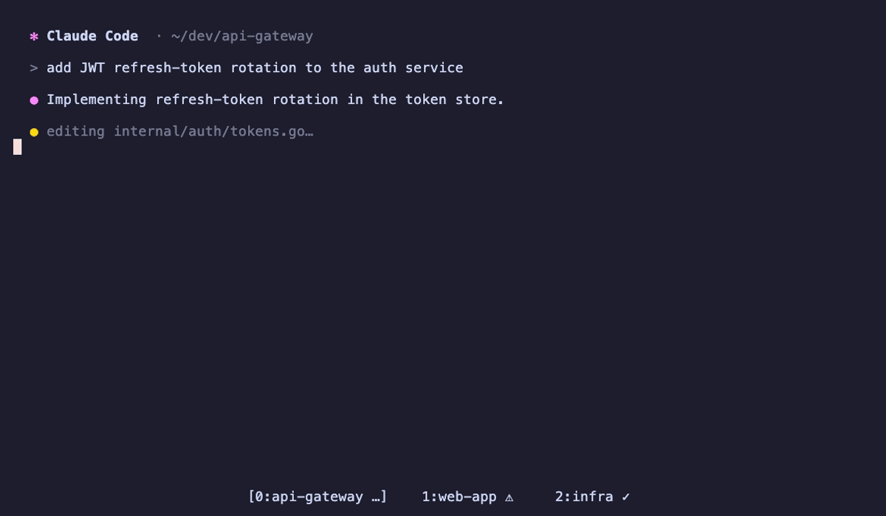

# cmanager

A tmux-native helper for working with many Claude Code sessions at once: get
notified in tmux when a session needs you or finishes a turn, and pop open a
picker to jump straight to any session's pane.



## Install

**Homebrew**

```sh
brew install philipparndt/cmanager/cmanager
cmanager setup     # wire the Claude hooks + tmux keybinding (shows a preview, asks first)
```

**From source** (requires Go)

```sh
git clone https://github.com/philipparndt/cmanager.git
cd cmanager
make install       # builds + installs bin/cmanager to ~/.local/bin
cmanager setup
```

Then reload tmux (`tmux source-file ~/.tmux.conf`) and restart your Claude
sessions so the hooks attach. See [Setup](#install-details) below for what
`cmanager setup` changes and how to wire it by hand.

## What it does

1. **Notifies you in tmux** when a Claude session in another pane needs your
   input or finishes a turn.
2. **A popup picker** listing every live Claude session with its status — pick
   one and it jumps to that session. Sessions are grouped by how they're reached:
   **tmux** panes first, then a **ghostty** section (macOS surfaces, for sessions
   run outside tmux), then a dimmed **can't jump** section for sessions reachable
   by neither. A session blocked on a usage limit shows a countdown to the reset
   (e.g. `⏳ 35m`) instead of its status.

It is *not* a terminal multiplexer: there is no screen mirroring, no PTY
wrapping, no pane resizing. tmux already does all of that. cmanager only adds the
thing tmux can't know on its own — which panes are Claude sessions and what
state they're in.

## How it works

- **Session list + status** come from `claude agents --json --all` (busy / idle)
  and the subagent logs under `~/.claude/projects/`.
- **Pane mapping + notifications** come from a Claude Code hook. `cmanager hook`
  runs on session events; it reads `$TMUX_PANE` from its environment to learn
  which pane the session lives in, records it under
  `~/.claude/cmanager/sessions/`, and drives tmux. Each session's window carries
  one of three states in the `@ai_status` window option, rendered as a glyph:
  - **UserPromptSubmit / PostToolUse** (Claude is actively working) →
    `@ai_status = working` → `…`. These also fire as work resumes right after you
    answer a prompt, so the ⚠ below clears immediately instead of lingering until
    the whole turn ends.
  - **Notification** (needs permission / waiting on input) → `@ai_status = needs`
    → `⚠`, and flashes a status-line message — unless that pane is the one you're
    already looking at.
  - **Stop** (turn finished) → `@ai_status = done` → `✓`, and flashes a
    "finished" message. Intermediate stops (`stop_hook_active`) stay `working`.
  - **SessionStart / SessionEnd** → record / drop the pane mapping (SessionEnd
    also clears the glyph).
- **The usage-limit countdown** (`⏳ 35m` on the window) comes from tmux itself:
  the window-status format includes `#(cmanager limit #{window_id})`, which tmux
  re-runs every `status-interval` (15s by default). It scans the window's session
  transcripts for a usage-limit error and prints the time until the limit resets,
  ticking down in the tab with no resident process. Once the reset passes but the
  session is still paused on the limit (it doesn't resume on its own), the badge
  switches to `▶` — that session is ready for you to jump back and continue it.

Everything degrades gracefully outside tmux (the hook just no-ops the tmux
calls).

<a name="install-details"></a>

## Setup

`cmanager setup` edits `~/.claude/settings.json` and `~/.tmux.conf` for you — it
backs each up first (`.bak-<timestamp>`), shows exactly what it will add, and
only writes after you confirm. It uses this binary's absolute path, so the tmux
popup works even though popups don't load your shell profile. It's idempotent —
re-run it any time. Then reload tmux (`tmux source-file ~/.tmux.conf`) and
restart your Claude sessions so the hooks attach.

The manual steps below are equivalent, if you'd rather wire it yourself.

### 1. Wire the Claude Code hook

Add to `~/.claude/settings.json` (use the full path to `cmanager` if it isn't on
the `PATH` Claude sees):

```json
{
  "hooks": {
    "Notification":     [{ "matcher": "", "hooks": [{ "type": "command", "command": "cmanager hook" }] }],
    "UserPromptSubmit": [{ "matcher": "", "hooks": [{ "type": "command", "command": "cmanager hook" }] }],
    "PostToolUse":      [{ "matcher": "", "hooks": [{ "type": "command", "command": "cmanager hook" }] }],
    "Stop":             [{ "matcher": "", "hooks": [{ "type": "command", "command": "cmanager hook" }] }],
    "SessionStart":     [{ "matcher": "", "hooks": [{ "type": "command", "command": "cmanager hook" }] }],
    "SessionEnd":       [{ "matcher": "", "hooks": [{ "type": "command", "command": "cmanager hook" }] }]
  }
}
```

### 2. Add the tmux snippet

In `~/.tmux.conf`:

```tmux
# prefix + a → open the session picker in a popup.
# Use an absolute path: tmux popups run via `sh -c` and do NOT source your
# shell profile, so a bare `cmanager` won't be found if ~/.local/bin isn't on
# the tmux server's PATH.
bind a display-popup -E -w 80% -h 70% '$HOME/.local/bin/cmanager pick'

# show each Claude session's state on its window (set by `cmanager hook`),
# plus a usage-limit countdown (⏳ 35m) that tmux refreshes every status-interval:
#   … working   ⚠ needs you   ✓ done   ⏳ 35m usage limit
set -g window-status-format         '#I:#W#{?#{==:#{@ai_status},needs}, ⚠,#{?#{==:#{@ai_status},working}, …,#{?#{==:#{@ai_status},done}, ✓,}}}#($HOME/.local/bin/cmanager limit #{window_id})'
set -g window-status-current-format '#I:#W#{?#{==:#{@ai_status},needs}, ⚠,#{?#{==:#{@ai_status},working}, …,#{?#{==:#{@ai_status},done}, ✓,}}}#($HOME/.local/bin/cmanager limit #{window_id})'
```

Reload with `tmux source-file ~/.tmux.conf`. Requires tmux ≥ 3.2 for
`display-popup`.

> If your shell profile prints anything unconditionally, gate it with
> `[[ $- == *i* ]]` so it doesn't interfere with hook I/O.

## Use

- Run Claude normally inside tmux panes — no wrapper needed.
- When a session in another pane needs you or finishes, you'll see it in the
  status line, and its window shows its state: `…` working · `⚠` needs you · `✓`
  done · `⏳ 35m` blocked on a usage limit (counts down to the reset) · `▶` the
  limit reset and the session is ready to continue. The `⚠` clears as soon as
  Claude resumes work, not just when it finishes.
- Hit `prefix + a` to open the picker. Keys: `↑/↓` move · `enter` jump to the
  pane · `space`/`←`/`→` collapse/expand a session's subagents · `/` filter ·
  `r` refresh · `q`/`esc` dismiss.
- Sessions show their subagents as a tree; a subtree whose work is **all done**
  is collapsed by default, and one with active work stays expanded.
- The panel under the list shows the selected session's directory and **what
  it's currently working on** (its latest prompt).
- It paints instantly from a cache and auto-refreshes (`⟳`) in the background
  while open.

## Commands

| Command          | Role                                                      |
|------------------|-----------------------------------------------------------|
| `cmanager`       | open the picker (alias: `cmanager pick`)                  |
| `cmanager hook`  | Claude Code hook target; reads the event JSON on stdin    |

## Layout

| File            | Purpose                                                       |
|-----------------|---------------------------------------------------------------|
| `main.go`       | subcommand dispatch + shared helpers                          |
| `pick.go`       | the popup picker (bubbletea) + jump (tmux / Ghostty)          |
| `hook.go`       | `cmanager hook`: event → registry + tmux notifications        |
| `tmux.go`       | tmux command helpers (notify, attention, jump, pid→pane)      |
| `ghostty.go`    | Ghostty AppleScript helpers (match a surface by cwd, focus it)|
| `registry.go`   | per-session pane/needs records under `~/.claude/cmanager`     |
| `session.go`    | `claude agents --json` polling                                |
| `tree.go`       | sessions + subagent discovery, flattened for the picker       |

## Notes

- A session started *before* the hook was installed has no recorded pane;
  cmanager falls back to matching the claude pid to a pane via the process tree,
  so jumping still works in most cases.
- A session running directly in a **Ghostty** window (no tmux) is jumpable via
  Ghostty's AppleScript dictionary (≥1.3.0): cmanager matches the surface whose
  working directory equals the session's cwd — preferring the one whose title
  carries Claude's `✳` mark — and `focus`es it. The first such jump may trigger a
  one-time macOS "control Ghostty" automation prompt. Ghostty exposes no pid/tty,
  so if two Claude sessions share a cwd the match can be ambiguous.
- Each running session consumes your subscription quota independently.
